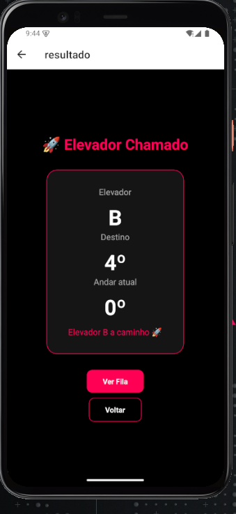

Liftly — Sistema Inteligente de Elevadores FIAP
-----------------------------------------------

Integrantes do Grupo:

Giovanna Praieiro Pavani — RM 565681

Julia Aparicio de Souza — RM 563623

Maria Eduarda de Oliveira — RM 565386

Nicolle Calasans Rosanti — RM 564381

------------------------------------

Sobre o Projeto:

O Liftly é um aplicativo mobile desenvolvido em React Native com o objetivo de melhorar a experiência dos alunos da FIAP no uso dos elevadores.

O problema identificado foi a lotação, demora e desorganização no uso dos elevadores, onde os alunos muitas vezes não conseguem entrar no elevador indicado ou enfrentam longas filas sem previsibilidade.

-------------------------------

O aplicativo propõe uma solução simples e prática:

1. O usuário informa o andar desejado.

2. O sistema indica um elevador disponível.

3. O usuário acompanha o status e sua posição na fila.

-----------------------------------------------------

Funcionalidades:

- Inserção do andar desejado.

- Indicação de elevador (A, B, C, D, E, F).

- Exibição de status do elevador: chegando, cheio ou disponível.

- Simulação de fila.

- Navegação entre telas.

- Interface simples e intuitiva.

-------------------------------

Como Rodar o Projeto:

Pré-requisitos:

Node.js instalado.

Expo Go (no celular) ou navegador.

-----------------------------------

Passo a passo:

bash

git clone https://github.com/gipraieiro/fiap-cpad-cp1-liftly.git

cd fiap-cpad-cp1-liftly

npm install

npx expo start

---------------------

Depois:

Escaneie o QR Code com o Expo Go, ou

Pressione W para abrir no navegador.

-----------------------------------

Demonstração do Aplicativo:

Tela Home:

Tela Resultado:

Tela Fila:

Vídeo demonstrando o funcionamento do app:
https://youtube.com/shorts/TsAi32Kq96E?feature=share

-----------------------------------------------------------

Decisões Técnicas:

Utilização de React Native com Expo para desenvolvimento multiplataforma.

Uso de useState para gerenciar estados do input e dados do app.

Uso de useEffect para simular comportamento dinâmico (ex.: movimentação do elevador e fila).

Navegação implementada com Expo Router.

Projeto dividido em componentes para melhor organização.

--------------------------------------------------------

Próximos Passos:

Integração com sistema real de elevadores.

Atualização em tempo real.

Sistema de notificações.

Melhorias na interface e experiência do usuário.

-----------------------------------------------------

Considerações Finais:

O Liftly busca resolver um problema real do dia a dia da FIAP de forma simples e eficiente, demonstrando como a tecnologia pode melhorar a experiência dos alunos dentro da instituição.
